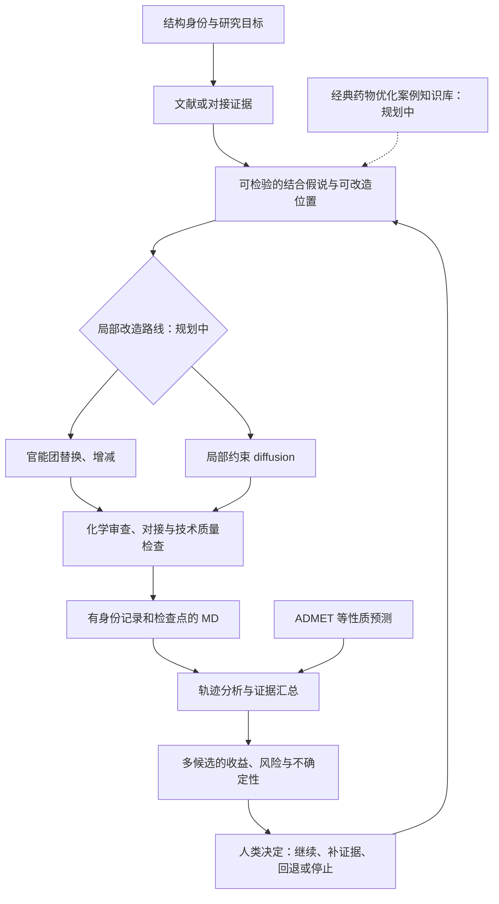

# MedChem Human Loop

**以可追溯计算证据支持局部分子优化，让人类决定风险与收益。**

[English](README.en.md) · [完整 workflow](docs/workflow-design.md) · [实现状态](docs/implementation-status.md) · [科学解释边界](docs/scientific-interpretation.md)

作者：**whlym**。工作流构思、计算执行、分析与代码整理使用 AI 辅助。原创代码采用 [MIT License](LICENSE)；引用信息见 [CITATION.cff](CITATION.cff)。

这个项目提出一个药物分子优化 workflow：结合文献、分子对接、分子动力学（MD）和 ADMET 预测，形成可检查的修改建议与风险收益评估，再由人类选择下一轮实验或计算。它希望帮助研究者回答：**为什么考虑改这个位置、证据有多可靠、可能得到什么、又可能失去什么？**

当前公开版提供**工作流设计、MD 执行与审阅工具、轨迹分析工具、可选的固定姿态复评分与 ADMET-AI 推理参考接口，以及可直接运行的合成证据整理示例**。它不是已经训练完成的强化学习模型，也还不是能自主发现和验证新药的完整平台。局部约束 diffusion、优化案例知识库和自动方法选择属于后续设计。

## 工作流



图描述目标流程；每一环节是否已有代码，请以 [实现状态表](docs/implementation-status.md) 为准。对接中的距离、接触或 MD 中的姿态稳定性用于提出和检查假说，不能单独证明亲和力提升。

## 先运行一个轻量示例

需要 Python 3.10 或更新版本；这一示例只使用标准库。

```bash
python scripts/assemble_evidence.py --input examples/synthetic_evidence.json --out outputs/demo
python -m unittest discover -s tests -v
```

示例读取**人工构造的合成数据**，校验并导出候选证据表及执行记录。它不执行 docking、MD、ADMET 模型推理或分子生成；输出数值不能作为药物研究结果。真实项目数据、轨迹和预构建 MD 系统不随本仓库发布。

整理器校验输入字段与完整性；诸如 `completed_reviewed` 的证据状态由输入提供者声明。它不会读取实际轨迹或审阅报告来认证这一状态，也不会把结构化数据自动升级成已验证结论。

输出目录须为新目录或空目录；再次演示时请为 `--out` 指定另一个路径，保留之前的执行记录。结构文件哈希只验证字节完整性，不验证化学身份或科学结论。

本次发布使用合成输入完成了 17 项轻量测试，并验证 4 行示例输出；这些检查不启动 MD。环境和具体覆盖见 [验证记录](tests/VALIDATION.md)。

## 代码包提供什么

| 文件 | 用途 | 需要的输入 |
|---|---|---|
| `scripts/assemble_evidence.py` | 校验并整理已提供的候选证据，保留来源与缺失状态 | 示例格式的 JSON |
| `scripts/run_md_v2.py` | 运行用户自备的 OpenMM 系统；记录输入身份、审阅、尝试、检查点与有效轨迹片段 | 兼容的预构建系统包 |
| `scripts/run_array_task_v2.py` | 根据任务清单调用 MD 执行器 | 任务清单和同一系统包 |
| `scripts/check_pilot_quality.py` | 读取短测试的日志和最终结构，生成技术质量报告 | 已完成短测试和系统输入 |
| `scripts/analyze_production_md.py` | 按有效片段分析 RMSD、接触与直接 N/O 氢键，输出表和图 | 匹配身份的轨迹、系统包和配体结构 |
| `extras/fixed_pose_admet/run_reference.py` | 调用 Vina/Vinardo 做固定姿态复评分，并用预训练 ADMET-AI 预测两个输入 | 自备合法结构、冻结输入清单、已安装软件及可信模型 |

MD 工具用于已经准备并审阅过的系统，**不负责蛋白修复、质子化选择、配体参数化或自动准备任意输入**。换体系前请检查 [MD 使用与输入约定](docs/md-execution.md)，并按实际结构选择分析中需关注的残基。

依赖按用途分离：`requirements-md.txt` 用于 MD/短测试检查，`requirements-analysis.txt` 用于轨迹分析。示例不需要安装这些科学计算依赖。详细的命令和源码改动记录见 [scripts/README.md](scripts/README.md)。

## 可选的实际评分与 AI 推理接口

[固定姿态复评分与 ADMET-AI 参考工具](extras/fixed_pose_admet/README.md) 来自此前实际执行过的研究复核脚本。它可对恰好两份用户提供的姿态分别执行 `vina`、`vinardo` 的 `--score_only`，随后调用已安装的预训练 ADMET-AI 模型。它不进行对接搜索、生成或训练，也不自动下载模型。

本次公开适配仅检查语法和 CLI，未重新执行评分或推理；原始研究数据和权重不随仓库发布。使用者需按该目录 README 准备并审阅输入。其输出目前需要人工审阅并转换为证据整理器的格式，尚未接成完整 workflow。

## AI 与人类各做什么

目标设计中，AI 协助检索和结构化经典优化案例、提出局部修改、选择需补充的计算证据，并起草带来源的候选比较。当前已有的 AI 模型调用代码是上述预训练 ADMET-AI 参考接口；其余生成与决策能力仍按实现状态表区分。计算工具产生可复核数据。

人类设定研究目标和可接受风险，审阅结构与方法的适用性，处理相互冲突的证据，并决定下一轮投入。例如，某候选的对接评分改善而预测毒性风险升高时，不应让一个未经校准的加权总分代替研究判断。

这些取舍有些可以建模，但权重、误差、适用人群和证据缺口仍需明确。本项目不声称人类判断不可量化，也不把多轮计算本身称为强化学习。详见 [完整设计](docs/workflow-design.md)。

## 科学与复现边界

- 对接分数是特定评分方法下的输出，不是实测结合自由能或亲和力。
- 单个随机种子的短程 MD 只能支持有限的姿态与相互作用观察；不证明收敛、药效或优化成功。
- ADMET 分类输出不能直接解释为真实毒性发生率。必须保留模型版本、单位、适用域和验证信息。
- 中断后应使用 `segment_manifest.json` 指定的有效轨迹前缀，不能直接拼接所有 DCD 文件；二进制检查点不可假设跨平台兼容。
- 公开示例与真实研究结论严格分开。当前没有发布新分子的实测活性证据，也没有宣称候选优于母药。

## 后续方向

1. 定义文献与经典药物优化案例的来源、许可和证据等级，构建可检索案例库。
2. 增加可审计的局部官能团变换、化学有效性检查及结构身份映射。
3. 在统一输入输出约定下整合已有的固定姿态复评分和性质预测参考工具，再接入完整 docking 搜索。
4. 验证局部约束 diffusion；比较它与规则替换的适用条件、成本和收益。
5. 建立决策记录、失败案例和多轮评估集，再评估是否有必要训练策略模型。

## 署名与使用

技术贡献与工作流构思：**whlym**，使用 AI 辅助。欢迎参考或扩展；学术使用建议引用 [CITATION.cff](CITATION.cff)，报告中可写“工作流与计算工具参考：whlym，MedChem Human Loop”。这是一项引用建议，不构成 MIT 之外的附加使用限制。保留许可证要求的版权与许可声明。

第三方软件、模型、文献和数据有各自的权利与许可；本仓库的 MIT License 不替代它们。详情见 [公开范围与来源](docs/provenance-and-release.md) 和 [AUTHORS.md](AUTHORS.md)。
