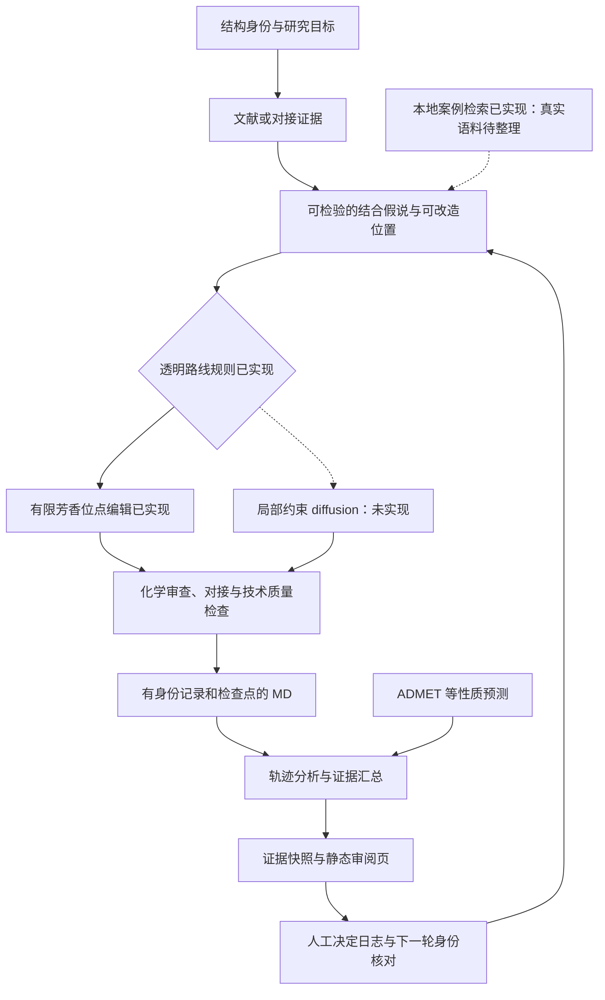

# MedChem Human Loop

**以可追溯计算证据支持局部分子优化，让人类决定风险与收益。**

[English](README.en.md) · [完整 workflow](docs/workflow-design.md) · [实现状态](docs/implementation-status.md) · [逐模块开发计划](docs/development-plan.md) · [学校算力 Agent 接手指南](docs/hpc/agent-start-here.md)

作者：**whlym**。工作流构思、计算执行、分析与代码整理使用 AI 辅助。原创代码采用 [MIT License](LICENSE)；引用信息见 [CITATION.cff](CITATION.cff)。

这个项目提出一个药物分子优化 workflow：结合文献、分子对接、分子动力学（MD）和 ADMET 预测，形成可检查的修改建议与风险收益评估，再由人类选择下一轮实验或计算。它希望帮助研究者回答：**为什么考虑改这个位置、证据有多可靠、可能得到什么、又可能失去什么？**

**v0.2 实现了第一批工作流模块**：本地案例记录与检索、人工指定位点的有限化学图编辑、透明路线规则、候选向缺失证据格式的转换，以及冻结证据后的 HTML 审阅页与人工决定日志。原有 MD 执行、质量检查、轨迹分析和可选的固定姿态复评分/ADMET-AI 参考工具继续保留。

这批模块可以逐步衔接，但尚未形成全自动计算平台。公开案例只有合成教学记录，**真实文献语料库为空**；局部编辑不是通用药物设计器，路线规则不是训练策略，审阅页与 CLI 不是完整交互界面。局部约束 diffusion、模型训练、真实计算端到端调度和自动风险收益建议仍待实现。

## 工作流



图同时展示已实现模块与目标连接，箭头不代表已经自动调度。每一环节的具体边界请以 [实现状态表](docs/implementation-status.md) 为准。对接中的距离、接触或 MD 中的姿态稳定性用于提出和检查假说，不能单独证明亲和力提升。

## 先运行一个轻量示例

需要 Python 3.10 或更新版本；这一示例只使用标准库。

```bash
python scripts/workflow_round.py prepare --input examples/synthetic_evidence.json --parent toy_parent --out outputs/round1
python scripts/workflow_round.py status --round outputs/round1
python -m unittest discover -s tests -v
```

打开 `outputs/round1/report.html` 查看**人工构造的合成证据**、缺失项和比较限制。准备步骤会冻结输入与结构文件，状态命令只检查完整性和决定记录。它不执行 docking、MD、ADMET 推理或分子生成；输出数值不能作为药物研究结果。真实项目数据、轨迹和预构建 MD 系统不随本仓库发布。

整理器校验输入字段与完整性；诸如 `completed_reviewed` 的证据状态由输入提供者声明。它不会读取实际轨迹或审阅报告来认证这一状态，也不会把结构化数据自动升级成已验证结论。

轮次输出目录必须不存在；再次演示时为 `--out` 指定另一个路径。结构文件哈希只验证字节完整性，不验证化学身份或科学结论。人工决定如何记录、如何关联下一轮，见 [一轮审阅流程](docs/review-rounds.md)。使用 RDKit 的可选生成链路见 [有限局部编辑](docs/local-edits.md) 与 [代码输入约定](scripts/README.md)；化学依赖不属于上述标准库示例的要求。

实际执行过的测试环境、覆盖、可选依赖与跳过项见 [验证记录](tests/VALIDATION.md)。轻量测试与示例不启动 MD；可选化学测试跳过不等于该环境完成了化学验证。

## 代码包提供什么

| 文件 | 用途 | 需要的输入 |
|---|---|---|
| `scripts/case_library.py` | 校验本地案例、按词和标签检索；保留来源与测定协议 | 自备 JSONL；公开只有合成案例 |
| `scripts/enumerate_local_edits.py` | 在人工指定的芳香 C–H 位点执行四种有限图变换 | 受支持的 SMILES、位点、固定原子及 RDKit |
| `scripts/route_proposal.py` | 依据明确规则提出路线或补证据建议，扩散路线保持阻塞 | 编辑范围、固定区域要求和案例支持状态 |
| `scripts/proposals_to_evidence.py` | 将局部编辑报告导出为证据输入，计算值保持缺失 | 编辑报告、靶点及明确的数据范围标签 |
| `scripts/workflow_round.py` | 冻结证据、生成 HTML、记录人工决定和轮次身份 | 证据 JSON，可选案例库、路线请求与上一轮 |
| `scripts/assemble_evidence.py` | 校验并整理已提供的候选证据，保留来源与缺失状态 | 示例格式的 JSON |
| `scripts/run_md_v2.py` | 运行用户自备的 OpenMM 系统；记录输入身份、审阅、尝试、检查点与有效轨迹片段 | 兼容的预构建系统包 |
| `scripts/run_array_task_v2.py` | 根据任务清单调用 MD 执行器 | 任务清单和同一系统包 |
| `scripts/check_pilot_quality.py` | 读取短测试的日志和最终结构，生成技术质量报告 | 已完成短测试和系统输入 |
| `scripts/analyze_production_md.py` | 按有效片段分析 RMSD、接触与直接 N/O 氢键，输出表和图 | 匹配身份的轨迹、系统包和配体结构 |
| `extras/fixed_pose_admet/run_reference.py` | 调用 Vina/Vinardo 做固定姿态复评分，并用预训练 ADMET-AI 预测两个输入 | 自备合法结构、冻结输入清单、已安装软件及可信模型 |
| `scripts/hpc_probe.py` | 为有权限的远程计算机收集只读运行证据 | 按接手指南指定的检查位置；不会自动登录或提交任务 |

MD 工具用于已经准备并审阅过的系统，**不负责蛋白修复、质子化选择、配体参数化或自动准备任意输入**。换体系前请检查 [MD 使用与输入约定](docs/md-execution.md)，并按实际结构选择分析中需关注的残基。

依赖按用途分离：`requirements-chem.txt` 用于有限图编辑，`requirements-md.txt` 用于 MD，`requirements-analysis.txt` 用于质量检查/轨迹分析。标准库示例不需要安装这些科学计算依赖。详细命令见 [scripts/README.md](scripts/README.md)。新 Agent 接手学校算力时先读 [接手指南](docs/hpc/agent-start-here.md)；里面区分历史故障、解决方法与当前仍须核查的状态，不包含真实账号或部署凭据。

## 可选的实际评分与 AI 推理接口

[固定姿态复评分与 ADMET-AI 参考工具](extras/fixed_pose_admet/README.md) 来自此前实际执行过的研究复核脚本。它可对恰好两份用户提供的姿态分别执行 `vina`、`vinardo` 的 `--score_only`，随后调用已安装的预训练 ADMET-AI 模型。它不进行对接搜索、生成或训练，也不自动下载模型。

本次公开适配仅检查语法和 CLI，未重新执行评分或推理；原始研究数据和权重不随仓库发布。使用者需按该目录 README 准备并审阅输入。其输出目前需要人工审阅并转换为证据整理器的格式，尚未接成完整 workflow。

## AI 与人类各做什么

目标设计中，AI 协助检索和结构化经典优化案例、提出局部修改、选择需补充的计算证据，并起草带来源的候选比较。当前已有的 AI 模型调用代码是上述预训练 ADMET-AI 参考接口。新增的案例检索、有限编辑和路线建议分别使用文字匹配、固定化学图规则和决策表，**没有训练或调用生成模型**。计算工具产生可复核数据。

人类设定研究目标和可接受风险，审阅结构与方法的适用性，处理相互冲突的证据，并决定下一轮投入。例如，某候选的对接评分改善而预测毒性风险升高时，不应让一个未经校准的加权总分代替研究判断。

这些取舍有些可以建模，但权重、误差、适用人群和证据缺口仍需明确。本项目不声称人类判断不可量化，也不把多轮计算本身称为强化学习。详见 [完整设计](docs/workflow-design.md)。

## 科学与复现边界

- 对接分数是特定评分方法下的输出，不是实测结合自由能或亲和力。
- 单个随机种子的短程 MD 只能支持有限的姿态与相互作用观察；不证明收敛、药效或优化成功。
- ADMET 分类输出不能直接解释为真实毒性发生率。必须保留模型版本、单位、适用域和验证信息。
- 中断后应使用 `segment_manifest.json` 指定的有效轨迹前缀，不能直接拼接所有 DCD 文件；二进制检查点不可假设跨平台兼容。
- 公开示例与真实研究结论严格分开。当前没有发布新分子的实测活性证据，也没有宣称候选优于母药。

## 后续方向

1. 逐条核对文献与许可，填充真实案例库，补充分子图和变换检索。
2. 扩展并验证当前有限化学规则，覆盖更复杂身份与合成可行性。
3. 连接结构准备、完整 docking、ADMET 与 MD，并在获准资源上验证真实端到端执行。
4. 接入并验证局部约束 diffusion，明确模型许可、固定区域和失败判据。
5. 基于真实评估集改进风险收益报告与交互界面，再判断是否需要训练策略。

各模块的交付顺序和验收边界见 [逐模块开发计划](docs/development-plan.md)。

## 署名与使用

技术贡献与工作流构思：**whlym**，使用 AI 辅助。欢迎参考或扩展；学术使用建议引用 [CITATION.cff](CITATION.cff)，报告中可写“工作流与计算工具参考：whlym，MedChem Human Loop”。这是一项引用建议，不构成 MIT 之外的附加使用限制。保留许可证要求的版权与许可声明。

第三方软件、模型、文献和数据有各自的权利与许可；本仓库的 MIT License 不替代它们。详情见 [公开范围与来源](docs/provenance-and-release.md) 和 [AUTHORS.md](AUTHORS.md)。
